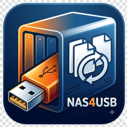

<p align="center">
  
</p>

# NAS4USB

USB(또는 단일 폴더)만으로 **오프라인 LAN NAS**와 **실시간 공동 편집**을 제공하는 Windows/macOS Electron 앱입니다. (v1.0.5)

- **Electron + Vite + React** — 로컬 파일 탐색기 UI
- **Y.js** — HWPX·XLSX·화이트보드·TipTap 실시간 동기화 (기본 포트 `3009`)
- **에디터 코어** — rhwp(HWPX), FortuneSheet(XLSX), WhiteBoard4Share(.wb4s), TipTap(.tiptap)
- **PDF 미리보기** — PDF.js 기반 연속 스크롤 · 썸네일 · 보기(줌) · 형광펜/밑줄([저장] 시 원본 기록) · Excel 내보내기

> **용도:** USB 이동·교실/회의실 LAN 협업. 인터넷 없이 동작하도록 설계되었습니다.

---

## 주요 기능

| 기능 | 설명 |
|------|------|
| USB 포터블 | `NAS4USB.exe` + 데이터 폴더를 USB에 복사해 실행 |
| 워크스페이스 | UI **공유폴더** / **개인폴더** ↔ 디스크 `share` / `private` |
| LAN 동기화 | Y.js WebSocket — 같은 방(room)에 접속한 클라이언트 간 CRDT 동기화 |
| HWPX 편집 | rhwp-studio 기반 `.hwpx` 브라우저 에디터 |
| Markdown / TXT | textarea 편집 · MD 미리보기 |
| TipTap 문서 | `.tiptap` — Notion-like TipTap 에디터 (ZIP+첨부, 슬래시 메뉴, 실시간 협업) |
| 스프레드시트 | FortuneSheet — `.xlsx` / `.xls` |
| 화이트보드 | `.wb4s` — WhiteBoard4Share 엔진 |
| PDF 미리보기 | 썸네일 · 너비/높이/페이지 맞춤 · 2쪽 보기 · 검색 · 형광펜/밑줄 · 엑셀 내보내기 |
| 파일 접근 제어 | 비공개·열람제한·공유 링크 (총괄관리자) |
| 회원 개인폴더 | 활성 회원 홈 자동 생성 · 삭제 시 정리 · 고아 폴더 prune |
| 휴지통 | 총괄관리자 전용 |
| 게스트 UI | 열람 권한 없을 때 로그인 유도 / 관리자 문의 안내 |
| 에디터 코어 업데이트 | `update_all.bat` — rhwp / wb4s / npm 코어 일괄 갱신 |

### 워크스페이스 경로

| UI(가상) | 디스크(기본) | 비고 |
|----------|--------------|------|
| 공유폴더 | `{DATA_ROOT}/share` | 공통 문서 |
| 개인폴더 | `{DATA_ROOT}/private/<회원ID>` | 회원별 홈 |
| (설정) | `DATA_ROOT` / 설정 `dataRoot` | 부모 루트. 미설정 시 프로그램 폴더 |

구버전에서 공유 루트가 `data`·`공유폴더`이거나 개인이 `개인폴더`인 경우, 실행 시 `share`/`private` 레이아웃으로 이전합니다.

### PDF 미리보기 (요약)

- **보기:** 확대/축소, 너비·높이·페이지 맞춤, 2쪽 보기, 회전, 인쇄
- **썸네일 / 형광펜:** 왼쪽 사이드 패널 전환
- **형광펜·밑줄:** 텍스트 드래그 → 메뉴에서 적용. **[저장]**으로 원본 PDF에 Highlight/Underline 기록·삭제 반영. 읽던 페이지·줌은 `파일명.pdf.viewer.json`에 자동 보관(파일당 공용). PDF에 이미 있는 주석(다른 뷰어 포함)은 목록에 `· PDF`로 표시하며, 본문이 비어 있으면 페이지에서 복원
- **형광펜 내보내기:** 인쇄 오른쪽 — 형광펜·밑줄을 Excel(`파일명_형광펜_밑줄_YYMMDD_HHMMSS.xlsx`)로 저장
- **목록 연동:** 목록↔본문 클릭으로 선택, 우클릭/`Delete` 삭제, `Ctrl+C` 복사. `· PDF` 삭제는 [저장] 후 원본에서도 제거
- 페이지는 보이는 구간만 지연 렌더링합니다.

---

## 빠른 시작 (개발)

### 1) 저장소 · 의존성

```bat
git clone https://github.com/soonpyopark/NAS4USB.git
cd NAS4USB
npm install
```

### 2) 환경 (선택)

```bat
copy .env.example .env
notepad .env
```

| 변수 | 기본값 | 설명 |
|------|--------|------|
| `PORT` | `3009` | HTTP + Y.js WebSocket 포트 |
| `HOSTNAME` | `0.0.0.0` | LAN 접속 허용 (`127.0.0.1` = 로컬만) |
| `DATA_ROOT` | (프로그램 폴더) | 데이터 루트. 하위에 `share`·`private` 생성 |
| `ADMIN_ID` / `ADMIN_PW` | `admin` / `admin1234` | 총괄관리자 (변경 권장) |

### 3) 실행

```bat
npm run dev
```

- **로컬:** http://127.0.0.1:3009  
- Electron 창이 자동으로 열립니다.

재시작: `npm run dev:restart` · 중지: `npm run dev:stop`

---

## Windows USB 빌드

```bat
npm run build:dist:exe
```

출력: `exe/NAS4USB_<버전>_<타임스탬프>/` (+ 동일 이름 `.zip`)

1. 폴더 전체를 USB에 복사  
2. `NAS4USB.exe` 실행  
3. LAN 사용 시 `.env.example` → `.env` 복사 후 `HOSTNAME=0.0.0.0` 확인  
4. 방화벽: `allow-firewall-inbound.bat` (관리자)  
5. 서버 중지: `stop_server.bat`

자세한 안내는 빌드 폴더의 `README-USB.txt`를 참고하세요.

### MSI 설치 패키지

```bat
npm run build:msi
```

출력: `msi/NAS4USB v<버전>_<타임스탬프>.msi` (WiX CLI 7+ 필요)

설정·회원·data 등은 설치 폴더(`%LOCALAPPDATA%\NAS4USB`)에 두되, MSI 패키지에는 넣지 않습니다.  
업데이트는 프로그램 파일만 교체하고 런타임 설정은 그대로 둡니다. (USB 포터블도 exe 옆과 동일)

### 릴리스 빌드 (MSI + portable, 동일 빌드 시각)

```bat
npm run build:release
```

Electron을 **한 번만** 패키징한 뒤, 같은 `YYMMDD_HHMMSS` 스탬프로 MSI와 portable zip을 만듭니다.

| 산출물 | 경로 |
|--------|------|
| MSI | `msi/NAS4USB v{version}_{stamp}.msi` |
| Portable zip (GitHub용) | `msi/NAS4USB v{version}_{stamp}_portable.zip` |
| Portable 폴더 | `exe/NAS4USB_{version}_{stamp}/` |

앱 안의 `APP_BUILD_STAMP`도 같은 값으로 심어져, GitHub Releases **업데이트 확인**이 버전뿐 아니라 빌드 시각을 비교합니다.  
(같은 태그로 MSI만 다시 올려도 스탬프가 더 새로우면 “새 빌드”로 안내됩니다.)

GitHub Release에 올릴 때 에셋 이름에 `_YYMMDD_HHMMSS`를 유지하세요.

### macOS 빌드 (macOS에서만)

```bat
npm run build:dist:mac
```

---

## 앱 업데이트 확인

트레이·상단바의 **업데이트 확인**은 GitHub `releases/latest`를 조회합니다.

1. 원격 버전(semver)이 더 높으면 → 새 버전  
2. 버전이 같고, 릴리스 에셋 이름의 빌드 스탬프가 로컬 `APP_BUILD_STAMP`보다 새면 → 같은 버전의 새 빌드  

스탬프는 `build:release` / `build:msi` / `build:dist:exe` 시 `shared/constants.js`의 `APP_BUILD_STAMP`에 기록됩니다.

---

## 에디터 코어 업데이트

인터넷 가능 PC에서 프로젝트 루트:

```bat
update_all.bat
```

업데이트 후 릴리스 패키지까지 빌드:

```bat
npm run build:update_all
```

(`update_all.bat` 후 `npm run build:release` — MSI + portable 동일 스탬프)

또는:

```bat
npm run update:all
npm run build:release
```

옵션: `build` `force` `skip-git` `skip-npm` `skip-cores`  
로그: `.cache/logs/update-all.log`  
상세: [`lib/updates/README.md`](lib/updates/README.md)

---

## npm 스크립트

| 명령 | 설명 |
|------|------|
| `npm run dev` | 아이콘·wb4s 준비 후 Electron 개발 실행 |
| `npm run dev:restart` / `dev:stop` | 개발 서버 재시작 / 중지 (포트 3009) |
| `npm run build` | rhwp-studio · wb4s · Vite 프로덕션 빌드 |
| `npm run build:dist:exe` | Windows portable 폴더 생성 |
| `npm run build:dist:mac` | macOS `.app` portable 폴더 생성 |
| `npm run build:msi` | Windows MSI 설치 패키지 생성 (WiX CLI 필요) |
| `npm run build:release` | MSI + portable을 동일 빌드 스탬프로 생성 |
| `npm run sync-version` | `APP_VERSION` → package.json / MSI License 동기화 |
| `npm run update:all` | 에디터 코어 + npm 의존성 업데이트 |
| `npm run build:update_all` | 코어 업데이트 + `build:release` |

---

## 폴더 구조 (요약)

```
NAS4USB/
├── main.js                 Electron 진입점
├── electron/               메인 프로세스 (서버, IPC, 파일 API, 워크스페이스)
├── src/                    React UI (Vite root)
│   ├── components/editors/ PdfViewerShell 등 뷰어·에디터
│   └── lib/pdf/            PDF.js 로드·검색·형광펜/선택·뷰어 사이드카
├── shared/                 공유 상수·경로(공유폴더/개인폴더 ↔ share/private)
├── lib/rhwp/               rhwp 어댑터 (파싱은 @rhwp/core WASM)
├── lib/updates/            오프라인 USB용 코어 업데이트 패키지
├── public/rhwp-studio/     HWPX 에디터 번들 (빌드 산출)
├── public/wb4s-editor/     화이트보드 embed 번들
├── scripts/                빌드·배포·update_all 스크립트
├── update_all.bat          코어 일괄 업데이트 (Windows)
├── data/                   기본 문서 저장소 예(개발 시)
│   ├── share/              공유폴더 디스크명
│   └── private/            개인폴더 디스크명
├── build/                  앱 아이콘 (prepare:icons)
├── LICENSE                 MIT
├── THIRD_PARTY_NOTICES.md  사용 오픈소스 고지
├── msi/                    MSI·portable zip 산출
└── exe/                    build:dist:exe 출력
```

---

## 에디터 코어 (현재 기준)

| 코어 | 패키지 / 경로 | 라이선스 (업스트림) |
|------|----------------|---------------------|
| HWPX (rhwp) | `@rhwp/core`, `@rhwp/editor` | MIT |
| Spreadsheet | `@fortune-sheet/react` | MIT |
| Whiteboard | `lib/updates/wb4s` / WhiteBoard4Share | AGPL-3.0-only |
| TipTap | `@tiptap/react`, `@tiptap/starter-kit` 등 | MIT |
| PDF 미리보기 | `pdfjs-dist` (PDF.js) — `src/lib/pdf/`, `PdfViewerShell` | Apache-2.0 |
| 실시간 동기화 | `yjs`, `y-websocket` | MIT |

버전 기록: `lib/cores-manifest.json`

---

## 라이선스

이 프로젝트(NAS4USB)는 **[MIT License](LICENSE)**입니다.

- 전체 전문: [`LICENSE`](LICENSE)
- 사용·번들하는 오픈소스 고지: [`THIRD_PARTY_NOTICES.md`](THIRD_PARTY_NOTICES.md)

Electron/Chromium 및 npm 패키지 등 서드파티는 각 라이선스를 따르며, MIT이 해당 컴포넌트를 재라이선스하지 않습니다.

주요 서드파티(요약):

| 구분 | 대표 컴포넌트 | 라이선스 |
|------|---------------|----------|
| 데스크톱 런타임 | Electron, Chromium | MIT / Chromium licenses |
| UI | React, Vite, Tailwind CSS | MIT |
| 협업 | Yjs, y-websocket | MIT |
| 문서 편집 | TipTap, rhwp, FortuneSheet, WhiteBoard4Share | MIT / AGPL-3.0-only |
| 문서/미디어 | PDF.js, SheetJS (`xlsx`), JSZip, KaTeX | Apache-2.0 / MIT 등 |

자세한 표와 직접 의존성 목록은 `THIRD_PARTY_NOTICES.md`와 `LICENSE` 하단 **Third-Party Components**를 참고하세요.

---

## 링크

- 블로그: https://note4all.tistory.com
- 저장소: https://github.com/soonpyopark/NAS4USB
